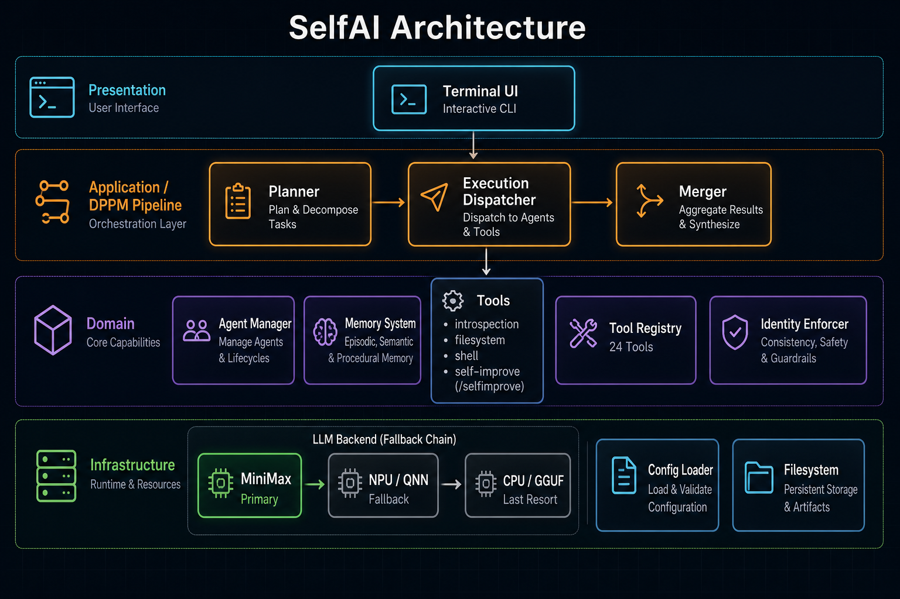

# SelfAI — Autonomous Multi-Agent System with Self-Improvement

[](LICENSE)
[](https://www.python.org/downloads/)

> **Status: Research prototype — not production-ready.** Core chat and the DPPM pipeline are runnable with a MiniMax API key, but agent mode (tool-calling), NPU acceleration, and `/selfimprove` are experimental. Expect rough edges, mixed German/English docs, and incomplete roadmap items.

**SelfAI** is an experimental terminal agent that plans multi-step work, calls tools, and can propose changes to its own codebase — with layered safety guardrails. It evolved from a Snapdragon NPU chatbot into a provider-agnostic **Distributed Planning Problem Model (DPPM)** pipeline backed primarily by **MiniMax M2**.

**Repository:** [github.com/smlfg/selfimproveSelfAI](https://github.com/smlfg/selfimproveSelfAI)

---

## What it does

| Capability | Status |
|---|---|
| Interactive terminal chat | Works with MiniMax API |
| DPPM pipeline (`/plan` → execute → merge) | Works; planner/merge providers configurable |
| Multi-backend fallback (MiniMax → NPU → CPU) | MiniMax primary; NPU/CPU need extra setup |
| Tool-calling agent loop | **Experimental** — off by default in `config.yaml` |
| `/selfimprove` (analyze → propose → approve → apply) | **Experimental** — proposal workflow with protected files |
| Identity enforcement & introspection tools | Implemented; quality varies by model |
| Web UI, RAG, parallel subtasks, Docker | **Not yet** — see [Roadmap](#roadmap) |

---

## Architecture

SelfAI uses a layered design: terminal UI → DPPM application layer → domain services (agents, memory, tools) → interchangeable LLM backends.



```
User → Terminal UI → [Planner] → Plan → [Executor] → Subtasks → [Merger] → Response
                              ↓                    ↓
                         Agent Manager         Tool Registry
                         Memory System         Identity Enforcer
                              ↓
                    MiniMax → NPU/QNN → CPU/GGUF  (fallback chain)
```

**Deep dives:** [docs/README.md](docs/README.md) · [CLAUDE.md](CLAUDE.md) · [SelfAiSoftwareArchitektur.md](SelfAiSoftwareArchitektur.md)

---

## SelfAI lineage

SelfAI grew through four pivots documented in [Die_Komplette_Geschichte_von_SELFAI.md](Die_Komplette_Geschichte_von_SELFAI.md):

1. **NPU-first chatbot** — Local inference on Snapdragon X Elite; fragile QNN tooling led to a hybrid CPU fallback.
2. **Proactive planner** — Ollama-based DPPM prototype: decompose goals → execute subtasks → merge results.
3. **Reproducible dev** — Dev containers and codified environments to end "works on my machine" drift.
4. **Super-agent** — Provider-agnostic config, MiniMax as default, tool system (filesystem, shell, introspection), and `/selfimprove` with anti-sabotage protections.

This repo (`selfimproveSelfAI`) is the **self-improvement and MiniMax-focused fork** of that lineage — same DPPM core, extended with custom agent loops, identity enforcement, and guarded self-modification.

---

## Quick start

**Prerequisites:** Python 3.12+, [MiniMax API key](https://api.minimax.io/), Git.

```bash
git clone https://github.com/smlfg/selfimproveSelfAI.git
cd selfimproveSelfAI

python -m venv .venv
source .venv/bin/activate          # Windows: .venv\Scripts\activate

pip install -r requirements.txt

cp .env.example .env               # add MINIMAX_API_KEY=...
cp config.yaml.template config.yaml

python selfai/selfai.py
```

**Try these commands** after launch:

| Command | What it does |
|---|---|
| Plain chat | Ask a question — uses configured LLM backend |
| `/plan <goal>` | Run the DPPM pipeline (needs planner enabled in config) |
| `/switch <agent>` | Switch persona (`code_helfer`, `projektmanager`, …) |
| `/memory` | Inspect or clear conversation memory |
| `/selfimprove analyze …` | Read-only improvement analysis (experimental) |

> **Agent mode** (autonomous tool-calling) is disabled by default. Set `system.enable_agent_mode: true` in `config.yaml` only if you accept the experimental risk. See [AGENT_MODE_FIXES_FINAL.md](AGENT_MODE_FIXES_FINAL.md).

**More setup paths:** [QUICK_START.md](QUICK_START.md) · [docs/BUILD.md](docs/BUILD.md) · [docs/SECRETS_AND_CONFIG.md](docs/SECRETS_AND_CONFIG.md)

---

## Project layout

```
selfimproveSelfAI/
├── selfai/
│   ├── selfai.py                 # Main CLI entry point
│   ├── core/                     # Agent loop, DPPM, LLM interfaces, identity
│   ├── tools/                    # Tool registry (introspection, filesystem, shell, …)
│   ├── ui/                       # Terminal UI themes
│   └── agents/                   # Persona configs & system prompts
├── docs/                         # Curated documentation index + images
├── config.yaml.template          # Copy to config.yaml
├── .env.example                  # API keys (not committed)
└── requirements.txt
```

---

## Safety (self-improvement)

`/selfimprove` uses a proposal workflow — analyze, present options, require user approval before any write. Core orchestration files are protected; sensitive paths need explicit consent. Automatic backups and git versioning support rollback.

| Tier | Examples |
|---|---|
| **Protected** (never auto-modified) | `selfai.py`, `config_loader.py`, `agent_manager.py`, `tool_registry.py` |
| **Sensitive** (user approval) | `execution_dispatcher.py`, `memory_system.py`, planner interfaces |
| **Allowed** (safer targets) | `selfai/tools/*.py`, `selfai/ui/*.py`, `*_interface.py` |

Full details: [SELFIMPROVE_SAFETY_SUMMARY.md](SELFIMPROVE_SAFETY_SUMMARY.md) · [ANTI_SABOTAGE_SAFETY.md](ANTI_SABOTAGE_SAFETY.md)

---

## Documentation

The repo has 80+ markdown files from iterative development. Start here:

| Doc | Purpose |
|---|---|
| **[docs/README.md](docs/README.md)** | **Main index** — all docs organized by topic |
| [QUICK_START.md](QUICK_START.md) | 5-minute setup |
| [CLAUDE.md](CLAUDE.md) | Full architecture reference |
| [SELFIMPROVE_GUIDE.md](SELFIMPROVE_GUIDE.md) | Self-improvement workflow |
| [UI_GUIDE.md](UI_GUIDE.md) | Terminal UI themes & commands |
| [docs/TROUBLESHOOTING.md](docs/TROUBLESHOOTING.md) | Common failures |

---

## Testing

```bash
python test_custom_agent_loop.py      # Agent loop smoke test
python test_tool_calling_direct.py    # Direct tool-calling test
./test_selfimprove_quick.sh           # Self-improve analysis (safe mode)
```

---

## Roadmap

- [ ] Parallel subtask execution in DPPM pipeline
- [ ] Web-based UI with real-time updates
- [ ] Vector database / RAG integration
- [ ] Multi-model ensemble
- [ ] Plugin system for custom tools
- [ ] Docker containerization

---

## Contributing

Contributions welcome — especially tests, doc clarity, and safety hardening. See scattered design notes in [docs/README.md](docs/README.md) before large changes.

---

## License

MIT — see [LICENSE](LICENSE).

---

## Acknowledgments

- **MiniMax** — M2 model and tool-calling format
- **smolagents** — early inspiration (replaced by custom agent loop)
- **Qualcomm / AnythingLLM / Ollama** — NPU and local inference paths
